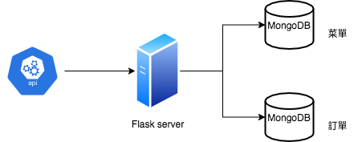
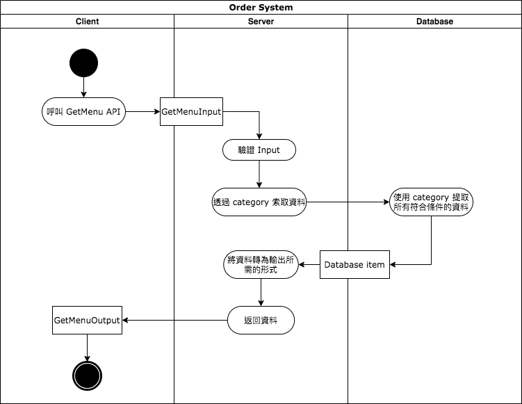
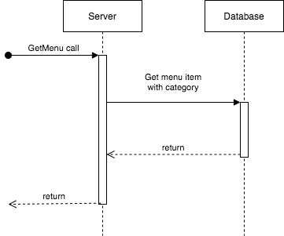

# 「踏出程式新手村！掌握敏捷式軟體開發流程」－ 點餐系統後端設計文件

## Use Cases

1. 當前端向後端發送索取菜單的請求時，後端要返回完整的菜單
2. 當前端向後端發送索取菜單的請求，並提供菜單類別時，後端要返回對應該類別的菜單
3. 當前端透過提供訂單號碼，向後端發送索取訂單的請求時，後端要返回對應該號碼的訂單
4. 當前端透過提供顧客姓名，向後端發送索取訂單的請求時，後端要返回該顧客所有的訂單
5. 當前端向後端發送建立訂單的請求時，須提供顧客姓名、下單時間、以及所有要下訂的菜單項目。收到請求後，後端要在資料庫中創建訂單，創建成功時要返回訂單的號碼

## Requirements

### Must have

- 返回菜單的 API
	- 請求內容為空時， 返回完整菜單
	- 請求中包含菜單類別時， 返回對應該類別的菜單
	- 若請求中的菜單類別不存在，則返回 error
- 查詢訂單的 API
	- 請求內容含有訂單號碼時，返回對應該號碼的訂單
	- 若請求中的訂單號碼不存在，則返回 error
	- 請求內容含有顧客姓名時，返回該顧客所有的訂單
	- 若請求中的顧客姓名不存在，則返回 error
- 建立訂單的 API
	- 請求中包含顧客姓名、下單時間、以及所有要下訂的菜單項目時，在資料庫中創建訂單，創建成功時要返回訂單的號碼
	- 若請求中的顧客姓名、下單時間、菜單項目之中其一不存在，則返回 error

### Out-Of-Scope

- 對返回的菜單進行排序的功能不在此專案的范圍內，會由前端負責實現。由後端返回的菜單品項沒有特定順序

## API Specification 

### GetMenu

簡介： 讀取菜單資訊。若請求中有提供菜單類別，則只返回相對應類別的菜單內容。

輸入: 

```
GetMenuInput: {
  @optional category: enum["Entree", "Side", "Drink"]
}
```

輸出：

```
GetMenuOutput: {
    menu: array<MenuItem>
}

MenuItem:{
    name: String,
    category: enum["Entree", "Side", "Drink"],
    price: int
}
```

Exception:

Invalid Input - 當輸入值的結構不符合 GetMenuInput 的要求時，返回此錯誤

Internal Server Error - 任何系統錯誤

### GetOrder

簡介： 輸入訂單號碼以讀取訂單資訊

輸入: 

```
GetOrderInput: {
  id: String,
}
```

輸出：

```
GetOrderOutput: {
    order: dict<OrderItem>
}

OrderItem: {
    id: String,
    customer: String,
    orderTime: timestamp,
    items: array<MenuItem.name>,
    totalPrice: int,
    status: String,
}
```

Exception:

Invalid Input - 當輸入值的結構不符合 GetOrderOutput 的要求時，返回此錯誤

Internal Server Error - 任何系統錯誤

### GetCustomerOrderOutput

簡介： 輸入顧客姓名以讀取訂單資訊

輸入: 

```
GetCustomerOrderOutput: {
  customer: String,
}
```

輸出：

```
GetCustomerOrderOutput: {
    order: array<CustomerOrderItem>
}

CustomerOrderItem: {
    id: String,
    customer: String,
    orderTime: timestamp,
    items: array<MenuItem.name>,
    totalPrice: int,
    status: String,
}
```

Exception:

Invalid Input - 當輸入值的結構不符合 GetCustomerOrderOutput 的要求時，返回此錯誤

Internal Server Error - 任何系統錯誤

### CreateOrder

簡介： 輸入顧客姓名、下單時間、以及所有要下訂的菜單項目以創建訂單，成功創建訂單時返回訂單號碼與訂單狀態

輸入: 

```
CreateOrderInput: {
    customer: String,
    orderTime: timestamp,
    items: array<MenuItem.name>
}
```

輸出：

```
CreateOrderOutput: {
    id: String,
    status: String,
}
```

Exception:

Invalid Input - 當輸入值的結構不符合 CreateOrderInput 的要求時，返回此錯誤

Internal Server Error - 任何系統錯誤

## Data Model

### Menu

structure:

```
{
    @primary id: ObjectId
    name: String,
    category: enum["Entree", "Side", "Drink"],
    price: int,
    type: enum["Regular", "Seasonal"]
}
```
Index: 

- category

### Order

structure:

```
{
    @primary id: String,
    customer: String,
    orderTime: timestamp,
    items: array<MenuItem.id>,
    totalPrice: int,
    status: String,
}
```

Index: 

- customer

## Component Diargram



## Activity Diargram



## Sequence Diargram




## Timeline

| Component | Task  | Description | Blocked by | Processing Time | Deadline |
| --- | --- | --- | --- | --- | --- |
| 建立菜單資料庫 |  |  |  |  | Sprint 1 |
|  | 1 | 建立菜單資料 |  | 2 days |  |
| 查詢菜單 API |  |  |  |  | Sprint 1 |
|  | 2 | 讀取並檢查輸入值 | Task 1 | 1 days |  |
|  | 3 | 從資料庫 query 所需資料 | Task 2 | 2 days |  |
| 查詢訂單 API |  |  |  |  | Sprint 1 |
|  | 4 | 讀取並檢查輸入值 | Task 3 | 2 days |  |
|  | 5 | 從資料庫 query 所需資料 | Task 4 | 3 days |  |
| 建立訂單 API |  |  |  |  | Sprint 1 |
|  | 6 | 讀取並檢查輸入值 | Task 5 | 2 days |  |
|  | 7 | 將所需建立之資料寫入資料庫 | Task 6 | 3 days |  |
